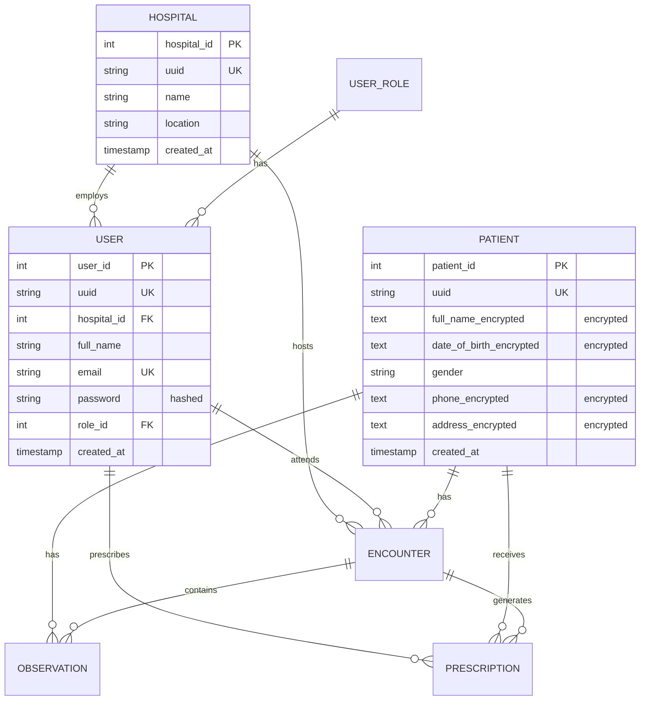

# Distributed EHR System

A Flask-based Electronic Health Records (EHR) system with REST APIs, encryption, and Docker support.

## Features

- **Complete REST CRUD APIs** for all models (Hospital, User, Patient, Encounter, Observation, Prescription)
- **Data Encryption**: Patient sensitive data and prescription notes encrypted at rest
- **Password Hashing**: User credentials securely hashed with Werkzeug
- **PostgreSQL Database**: Production-ready database with SQLAlchemy ORM
- **Docker Support**: Full containerization with Docker Compose
- **Seed Data**: Sample data script for testing

## Architecture

### Data Model
The system includes 7 main entities with relationships:
- **Hospital**: Medical facilities
- **UserRole**: Role definitions (Doctor, Nurse, Admin)
- **User**: Hospital staff with encrypted passwords
- **Patient**: Patient records with encrypted PII
- **Encounter**: Patient visits
- **Observation**: Medical measurements during encounters
- **Prescription**: Medications prescribed by doctors

See the [data model diagram](#data-model-diagram) below.

## Quick Start

### Prerequisites
- Docker and Docker Compose installed
- OR Python 3.11+ with PostgreSQL

### Using Docker (Recommended)

1. **Start the application**:
   ```bash
   docker-compose up --build
   ```

2. **Seed the database** (in another terminal):
   ```bash
   docker-compose exec app python seed.py
   ```

3. **Access the API**:
   - Base URL: `http://localhost:5002`
   - Health check: `http://localhost:5002/health`

### Manual Setup

1. **Install dependencies**:
   ```bash
   pip install -r requirements.txt
   ```

2. **Set up PostgreSQL** and update `DATABASE_URL` in config.py

3. **Run the application**:
   ```bash
   python app.py
   ```

4. **Seed the database**:
   ```bash
   python seed.py
   ```

## API Endpoints

All endpoints return JSON. Base URL: `http://localhost:5002`

### Hospital
- `POST /hospitals` - Create hospital
- `GET /hospitals` - List all hospitals
- `GET /hospitals/<id>` - Get hospital by ID
- `PUT /hospitals/<id>` - Update hospital
- `DELETE /hospitals/<id>` - Delete hospital

### User Roles
- `POST /roles` - Create role
- `GET /roles` - List all roles
- `PUT /roles/<id>` - Update role

### Users
- `POST /users` - Create user
- `GET /users` - List all users
- `GET /users/<id>` - Get user by ID
- `PUT /users/<id>` - Update user
- `DELETE /users/<id>` - Delete user

### Patients
- `POST /patients` - Create patient (encrypts sensitive data)
- `GET /patients` - List all patients (decrypts for display)
- `GET /patients/<id>` - Get patient by ID
- `PUT /patients/<id>` - Update patient
- `DELETE /patients/<id>` - Delete patient

### Encounters
- `POST /encounters` - Create encounter
- `GET /encounters` - List all encounters
- `GET /encounters/<id>` - Get encounter by ID
- `PUT /encounters/<id>` - Update encounter
- `DELETE /encounters/<id>` - Delete encounter

### Observations
- `POST /observations` - Create observation
- `GET /observations` - List all observations
- `GET /observations/<id>` - Get observation by ID
- `PUT /observations/<id>` - Update observation
- `DELETE /observations/<id>` - Delete observation

### Prescriptions
- `POST /prescriptions` - Create prescription (encrypts notes)
- `GET /prescriptions` - List all prescriptions (decrypts notes)
- `GET /prescriptions/<id>` - Get prescription by ID
- `PUT /prescriptions/<id>` - Update prescription
- `DELETE /prescriptions/<id>` - Delete prescription

## API Examples

### Create a Hospital
```bash
curl -X POST http://localhost:5002/hospitals \
  -H "Content-Type: application/json" \
  -d '{"name": "General Hospital", "location": "123 Main St"}'
```

### Create a Patient (with encryption)
```bash
curl -X POST http://localhost:5002/patients \
  -H "Content-Type: application/json" \
  -d '{
    "full_name": "John Doe",
    "date_of_birth": "1990-01-15",
    "gender": "Male",
    "phone": "555-1234",
    "address": "456 Oak Ave"
  }'
```

### Get All Users
```bash
curl http://localhost:5002/users
```


### Postman Collection
`https://huzaifa-2937241.postman.co/workspace/distributed-ehr~13c9bc0a-9e39-4b8c-83c4-29342ae61aa7/collection/45457587-e34cdb2e-ca72-4299-a0fd-1f83ae2c242e?action=share&creator=45457587&active-environment=45457587-7116d4eb-5b83-4bf3-b6b7-b484b6fa2db5`

## Security Features

### Encryption
- **Patient Data**: Full name, date of birth, phone, and address encrypted using Fernet (symmetric encryption)
- **Prescription Notes**: Encrypted notes for privacy
- **User Passwords**: Hashed using Werkzeug's pbkdf2:sha256

### Environment Variables
Configure these in production:
- `SECRET_KEY`: Flask secret key
- `ENCRYPTION_KEY`: Fernet encryption key (32 bytes)
- `DATABASE_URL`: PostgreSQL connection string

## Sample Data

The `seed.py` script creates:
- 1 Hospital (City General Hospital)
- 3 User Roles (Doctor, Nurse, Admin)
- 4 Users (2 doctors, 1 nurse, 1 admin) - password: `password123`
- 3 Patients (with encrypted PII)
- 3 Encounters
- 5 Observations
- 3 Prescriptions (with encrypted notes)

## Data Model Diagram



## Development

### Stop the application
```bash
docker-compose down
```

### View logs
```bash
docker-compose logs -f app
```

### Access database directly
```bash
docker-compose exec db psql -U ehr_user -d ehr_db
```

### Reset database
```bash
docker-compose down -v
docker-compose up --build
docker-compose exec app python seed.py
```

## Project Structure

```
distributed-ehr/
└──app
   ├── app.py              # Main Flask application with API routes
   ├── database.py         # SQLAlchemy models
   ├── config.py           # Configuration settings
   ├── encryption.py       # Encryption utilities
   ├── seed.py             # Sample data script
   ├── requirements.txt    # Python dependencies
   ├── Dockerfile          # Docker container definition
   └── docker-compose.yml  # Multi-container orchestration
└──test
   └── test_api.py         # app test cases
└──postman
   └──EHR.postman_collection.json  #app postman collection     
└── README.md              # Documentation
```

## Notes

- All sensitive patient data is encrypted at rest
- User passwords are hashed (not encrypted) for security
