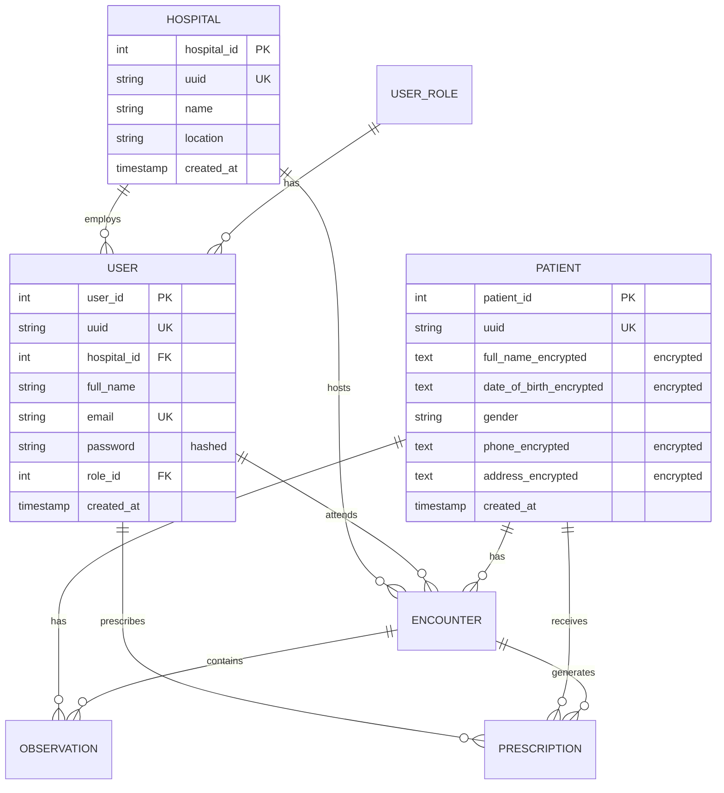

# Distributed EHR System

A highly available, distributed Electronic Health Records (EHR) system. This version implements a custom Raft Consensus Algorithm to ensure data consistency across a multi-node cluster, featuring automated request forwarding and end-to-end encryption.

## 🌟 Key Features

* **Raft-Based Consensus**: Automated leader election and heartbeat-driven health monitoring.
* **Write-Anywhere Architecture**: Clients can send write requests to *any* node; Followers automatically proxy requests to the Leader.
* **Generic Replication Engine**: A single, unified replication receiver handles all models (Hospitals, Patients, Users, Roles, etc.) via UUID-based synchronization.
* **PII Encryption**: Patient sensitive data (Names, DOB, Phone, Address) and Prescription notes are encrypted at rest using AES-256.
* **Security**: Inter-node communication is secured via a shared `CLUSTER_AUTH_TOKEN`.
* **Scalability**: Read requests (`GET`) are served locally by each node to reduce Leader load.

---

## 🏗 System Architecture

### 1. Data Consistency Model

The system uses a "Primary-Secondary" replication model governed by Raft:

* **Leader Node**: Manages the cluster state and is the source of truth for all writes.
* **Follower Nodes**: Maintain local copies of the database and handle read requests.
* **Forwarding**: If a Follower receives a `POST/PUT/DELETE`, it uses the `handle_write_request` middleware to proxy the request to the Leader's URL.

### 2. Global Identity (UUID)

To prevent ID collisions across distributed databases, every record is assigned a **UUID v4**. While local databases use auto-incrementing integers for internal foreign keys, all inter-node replication and API updates use the UUID as the unique identifier.

---

## 🚀 Quick Start

### Prerequisites

* Docker and Docker Compose
* Postman (optional, for testing)

### 1. Start the 3-Node Cluster

The easiest way to run the system is using the provided Docker Compose file, which spins up three application nodes and three independent PostgreSQL databases.

```bash
docker-compose up --build

```

| Node | API Port | Internal ID | Role (Initial) |
| --- | --- | --- | --- |
| **Node 1** | `5001` | `node1` | Candidate/Leader |
| **Node 2** | `5002` | `node2` | Follower |
| **Node 3** | `5003` | `node3` | Follower |

### 2. Postman Collection
`https://huzaifa-2937241.postman.co/workspace/distributed-ehr~13c9bc0a-9e39-4b8c-83c4-29342ae61aa7/collection/45457587-e34cdb2e-ca72-4299-a0fd-1f83ae2c242e?action=share&creator=45457587&active-environment=45457587-7116d4eb-5b83-4bf3-b6b7-b484b6fa2db5`

---

## 📡 API Reference

### Cluster Management

| Endpoint | Method | Description |
| --- | --- | --- |
| `/cluster/leader` | `GET` | Returns current node state and leader info. |
| `/endpoints` | `GET` | Lists all available API routes. |
| `/health` | `GET` | Simple health check. |

### EHR Core APIs

*Note: All write operations automatically forward to the Leader.*

#### 🏥 Hospitals

* `POST /hospitals` - Create hospital (Replicated)
* `GET /hospitals` - List all hospitals (Local Read)
* `PUT /hospitals/<id>` - Update hospital (Replicated)

#### 👥 User Roles

* `POST /roles` - Create role (Replicated via Name)
* `GET /roles` - List roles

#### 👨‍⚕️ Users

* `POST /users` - Create staff user (Hashes password once, replicates hash)
* `GET /users` - List all users

#### 📋 Patients

* `POST /patients` - Create patient (Encrypts PII, Replicates raw data)
* `GET /patients` - List patients (Decrypts PII for display)
* `DELETE /patients/<id>` - Cluster-wide deletion

---

## 🔒 Security Implementation

### Encryption Logic

1. **Leader Action**: Receives raw data $\rightarrow$ Encrypts $\rightarrow$ Saves to DB.
2. **Replication**: Leader sends raw data to Followers.
3. **Follower Action**: Receives raw data $\rightarrow$ Encrypts using local `ENCRYPTION_KEY` $\rightarrow$ Saves to DB.

### Password Security

Passwords are never replicated in plain text. The Leader hashes the password using `pbkdf2:sha256`, and this secure hash is what is synchronized to the Follower nodes.

---

## 📂 Project Structure

* `app.py`: Main Flask entry point and API routes.
* `replication.py`: Contains `@handle_write_request` and `broadcast_replication`.
* `cluster.py`: The Raft Engine (Heartbeats, Election Timers, State management).
* `database.py`: SQLAlchemy models with UUID support.
* `encryption.py`: Utilities for Fernet encryption and hashing.
* `seed.py`: API-driven script to populate the cluster with initial data.

---


## Data Model Diagram


```mermaid
erDiagram
    HOSPITAL ||--o{ USER : employs
    HOSPITAL ||--o{ ENCOUNTER : hosts
    USER_ROLE ||--o{ USER : has
    USER ||--o{ ENCOUNTER : "attends"
    USER ||--o{ PRESCRIPTION : "prescribes"
    PATIENT ||--o{ ENCOUNTER : has
    PATIENT ||--o{ OBSERVATION : has
    PATIENT ||--o{ PRESCRIPTION : receives
    ENCOUNTER ||--o{ OBSERVATION : contains
    ENCOUNTER ||--o{ PRESCRIPTION : generates
    
    HOSPITAL {
        int hospital_id PK
        string uuid UK
        string name
        string location
        timestamp created_at
    }
    
    USER {
        int user_id PK
        string uuid UK
        int hospital_id FK
        string full_name
        string email UK
        string password "hashed"
        int role_id FK
        timestamp created_at
    }
    
    PATIENT {
        int patient_id PK
        string uuid UK
        text full_name_encrypted "encrypted"
        text date_of_birth_encrypted "encrypted"
        string gender
        text phone_encrypted "encrypted"
        text address_encrypted "encrypted"
        timestamp created_at
    }
```
